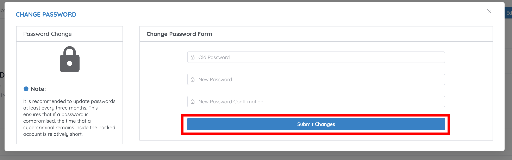

# Change your password

Use this when you're already signed in and want to replace your password. If you can't sign in at all, use [Reset a forgotten password](../getting-started/reset-password.md) instead.

## Steps

1. From the Dashboard, click the **Profile** icon in the top-right corner and select **My Profile**.

    

2. On the **My Profile** page, click **Change Password**.

    
3. Enter your **Old Password**.
4. Enter and confirm the **New Password**.
5. Click **Submit Changes**.

    

!!! tip "TCAA's recommendation"
    The portal advises updating your password **at least every three months**. If a password is ever compromised, a short rotation window limits how long an attacker can stay inside the account.

## Next step

Back to [Update your profile](edit-profile.md), or on to [Manage entity information](entity-information.md).
