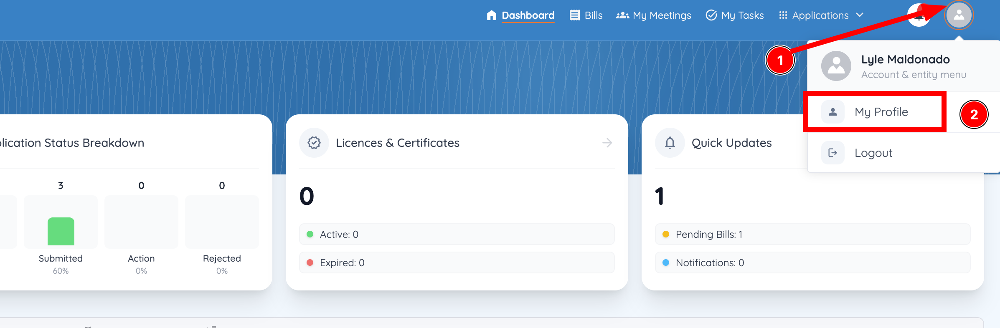
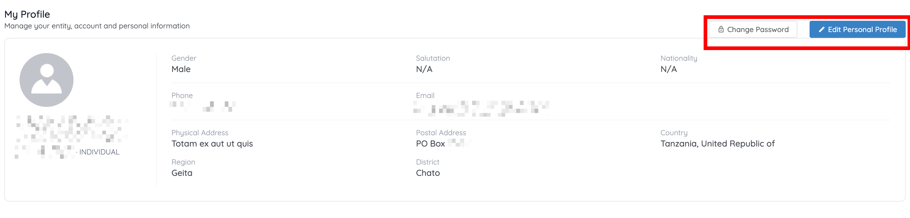
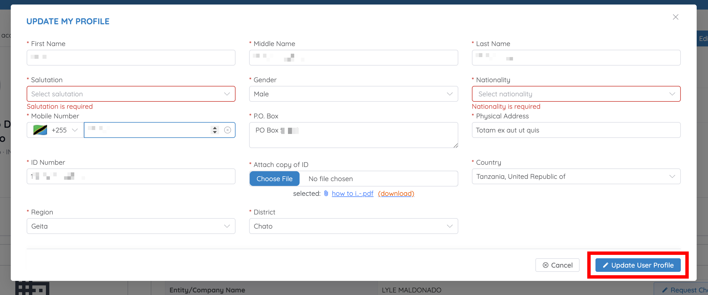

# Update your profile

The **My Profile** page is where you manage your personal information and, where your account type includes it, your organisation's information.

## Open your profile

1. From the Dashboard, click the **Profile** icon in the top-right corner.
2. Select **My Profile**.

    

The **My Profile** page is displayed.

## Update your personal information

1. On the **My Profile** page, click **Edit Personal Profile**.

    

2. Update the required information on the **Update My Profile** form — first, middle, and last name, salutation, gender, nationality, mobile number, P.O. Box, physical address, ID number, a copy of your ID, country, region, and district.
3. Click **Update User Profile** to apply the changes.

    

A confirmation message appears once your profile has been updated successfully.

!!! tip "Fields marked with an asterisk are required"
    The form validates as you go — a required field you've left empty is outlined in red with a message beneath it, and the form won't submit until it's filled. If **Update User Profile** doesn't seem to do anything, scroll up and look for a red field.

!!! tip "Replacing your ID document"
    **Attach copy of ID** shows the file already on record, with a **(download)** link so you can check what's there before replacing it. Choosing a new file replaces the old one.

## Other things on this page

- **[Change Password](change-password.md)** — replace your password without signing out
- **[Entity Details, Entity Attachments, Branches, Customers, Client Employees, Head of Entity, and Account Users](entity-information.md)** — organisation-level records, shown where your account type includes them

!!! info "What's shown depends on your account type"
    The **My Profile** page displays your personal information and, where applicable, the information associated with your organisation (entity). Individual accounts see fewer sections than organisation accounts.
