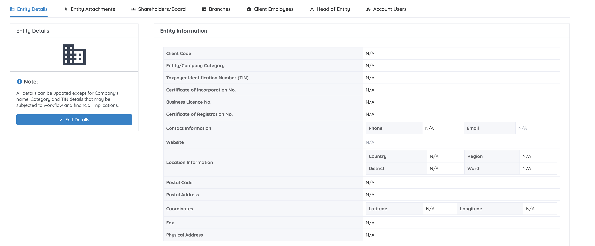
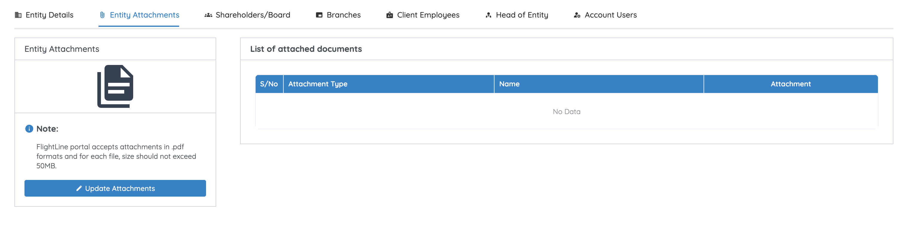
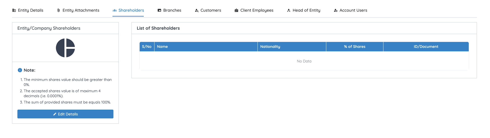
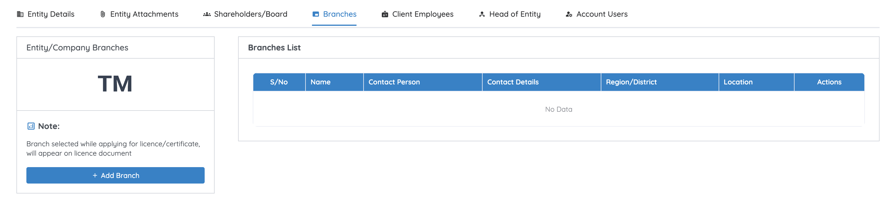
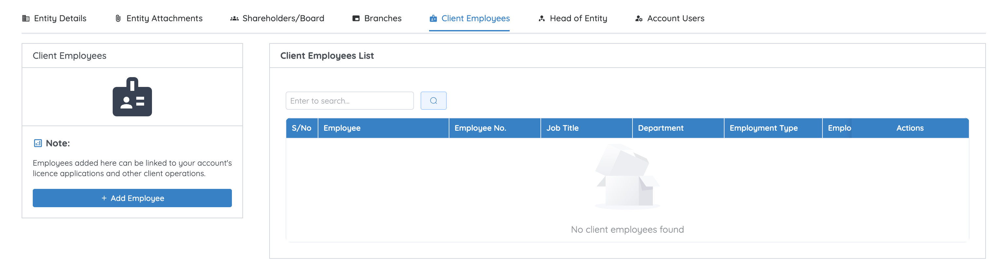
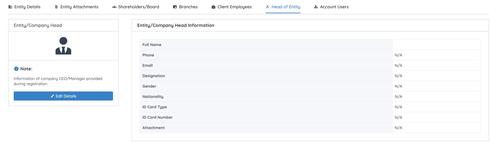
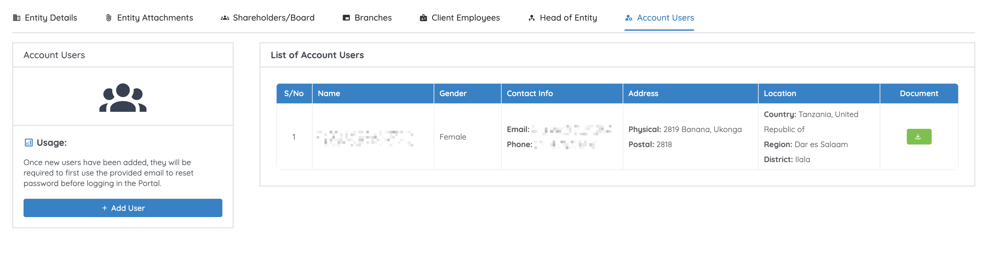

# Manage entity information

If you registered an **Organization account**, your **My Profile** page holds your organisation's records as well as your personal ones. What you see depends on the account type you registered — individual accounts have fewer sections.

Open **My Profile** from the profile icon, then use the tabs across the top: **Entity Details**, **Entity Attachments**, **Shareholders/Board**, **Branches**, **Client Employees**, **Head of Entity**, and **Account Users**.

Every tab follows the same layout: a panel on the left with a **Note** explaining what the section is for and its action button, and the records themselves on the right.

## Entity Details

Your organisation's registration record: client code, category, TIN, certificate of incorporation and registration numbers, business licence number, contact information, website, location, postal code and address, coordinates, fax, and physical address.

1. Click **Edit Details**.
2. Update the information.
3. Click **Update Details** to save the changes.

!!! warning "Three fields you can't edit directly"
    **Company name**, **Category**, and **TIN** can't be changed from the edit form — a change to any of them may carry workflow and financial implications. Where a name change is genuinely needed, look for a **Request Change Name** option on the Entity Details panel, which raises a request to TCAA.

## Entity Attachments

The organisation's supporting documents, listed by attachment type and name.

1. Click **Update Attachments** to upload or replace the required document(s).

!!! tip "File rules for entity attachments"
    Attachments must be **PDF**, and each individual file must not exceed **50 MB**.

    Note that this is a per-file limit on the entity profile, and is different from the **100 MB** combined limit that applies to [attachments on an application](../applications/drafts.md).

## Shareholders/Board

Your organisation's shareholders and board members — name, nationality, percentage of shares, and an ID document.

1. Click **Edit Details** to add or update a shareholder.
2. Click **Save**.

!!! warning "Shareholding rules"
    - Each shareholder's stake must be greater than **0%**.
    - Shares accept up to **4 decimal places** (e.g. 0.0001%).
    - The shares recorded across all shareholders must **sum to exactly 100%**.

## Branches

Your branch offices, each with a name, contact person, contact details, region/district, and location.

1. Click **Add Branch**.
2. Enter the branch information.
3. Click **Save Branch**.

!!! info "Branches appear on the credential"
    The branch you select when applying for a licence or certificate is printed on the issued licence document — so add the branch before you start the application, and pick the right one.

## Client Employees

Employee records linked to the entity — employee number, job title, department, and employment type.

1. Click **Add Employee**.
2. Enter the employee's information.
3. Click **Save Employee**.

!!! info "What this is for"
    Employees added here can be linked to your account's licence applications and other client operations.

## Head of Entity

The CEO or manager provided during registration: full name, phone, email, designation, gender, nationality, ID card type and number, and an ID attachment.

1. Click **Edit Details**.
2. Update the required information.
3. Click **Update Entity Head** to save.

## Account Users

Other portal users linked to your entity — name, gender, contact info, address, location, and their identity document.

1. Click **Add User**.
2. Enter the user's information.
3. Save the changes.

!!! warning "New users must reset their password first"
    Once a new user has been added, they can't sign in with a password you set for them. They must first use the email address you provided to run the **[password reset](../getting-started/reset-password.md)** flow, set their own password, and then sign in.

## Next step

Head to the [Dashboard](../dashboard/overview.md) to start an application, or review [how to change your password](change-password.md).
