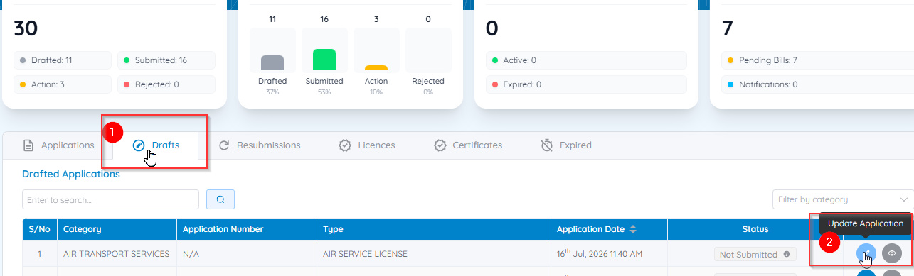
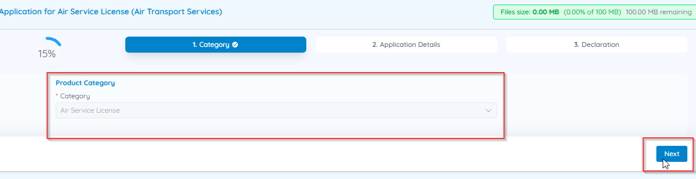

# Save and resume drafts

CASP automatically saves your application as a **Draft** whenever you leave it before submitting. You won't lose any information you've already entered.

## Resume a draft application

1. From the Dashboard, go to **Track your Applications**.
2. Select the **Drafts** tab.
3. Locate the application you want to continue.
4. In the **Actions** column, select **Update Application**.

    

5. The system reopens your application with its category already selected. Click **Next** to continue where you left off.

    

!!! tip "Attachment rules"
    All supporting documents must be **PDF** — JPG/PNG images and Word documents are rejected. The combined size of all attachments for a single application must not exceed **100 MB**; the remaining quota is shown at the top of the application form (e.g. "100.00 MB remaining").
