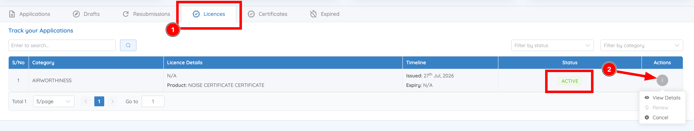
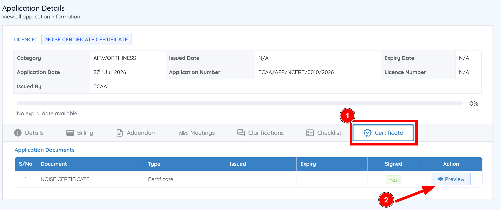
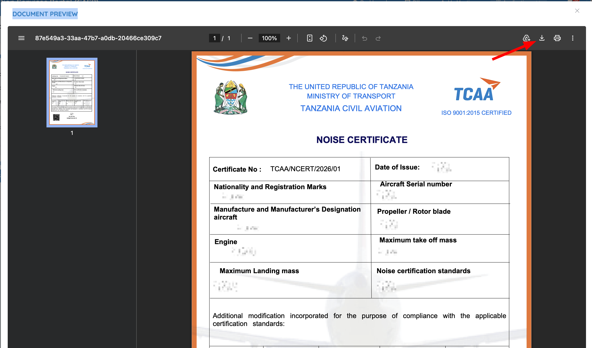

# View and download an issued licence, permit, or certificate

Once TCAA has approved a regulatory application, the resulting licence, permit, or certificate is issued electronically and made available for viewing and download from your Dashboard.

## Steps

1. From the Dashboard, go to **Track your Applications**.
2. Select either the **Licences** tab or the **Certificates** tab.
3. Locate the required record and check the **Status** column — it should read **Active** or **Expired**.

    

4. Under **Actions**, click the action button for the record and select **View Details**.

    The same menu also offers **Renew** and **Cancel**. **Renew** only becomes available once a licence has expired — on an Active licence it stays disabled.

    The **Application Details** window opens for the record.

5. Select the **Certificate** tab, alongside **Details**, **Billing**, **Meetings**, **Clarifications**, and **Checklist**.
6. Under **Application Documents**, click **Preview** next to the issued document.

    

7. In the document preview window, review the document, then click **Download** to save an official copy to your device.

    

## Next step

Back to [Application status meanings](statuses.md), [respond to a clarification](../clarifications/respond.md), or to the [Dashboard](../dashboard/overview.md).
