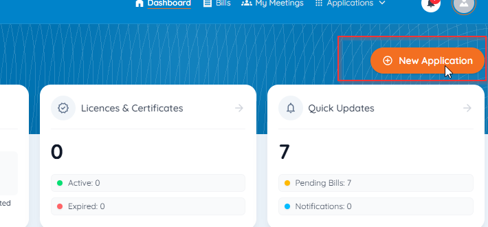
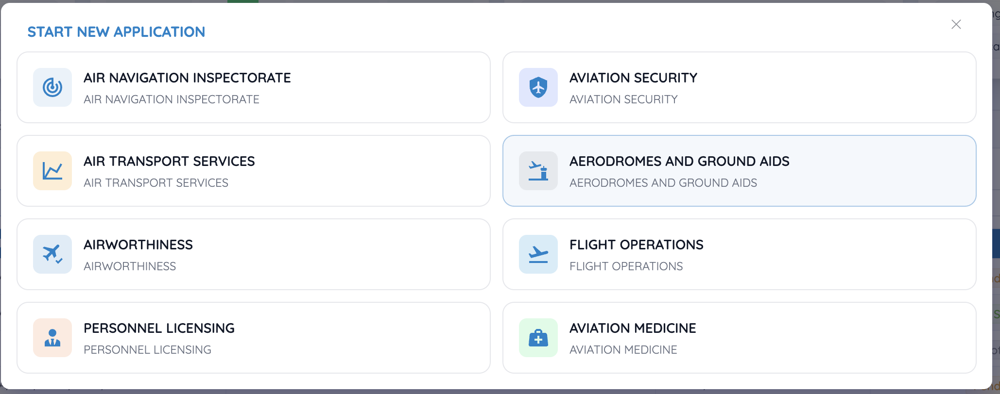
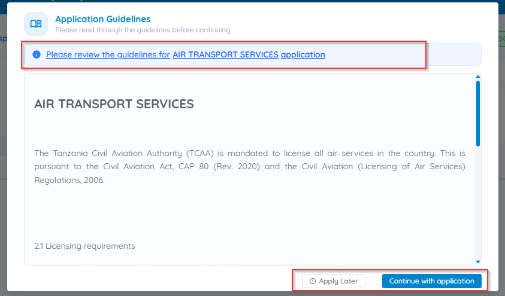
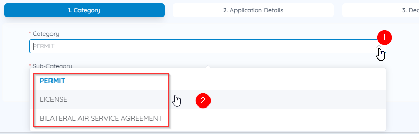
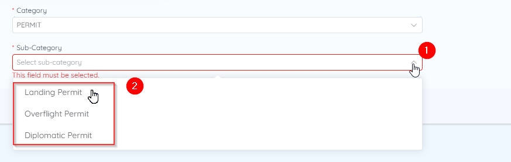
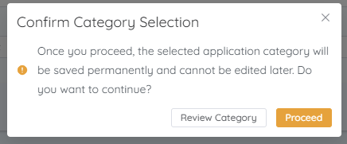

# Start a new application

The available service streams, application categories, and sub-categories vary by regulatory service, but the navigation process is the same for every application.

## 1. Open the application starter

From the Dashboard, click **New Application**.

## 2. Select a service stream

Choose the regulatory service stream that matches what you need — for example, Airworthiness, Flight Operations, or Air Transport Services.

!!! warning "The tiles aren't in a fixed order"
    The eight streams don't always appear in the same positions — read the labels rather than clicking by memory or by position. Picking the wrong stream means starting the application again, and once you're past the category confirmation it can't be undone.

## 3. Review the application guidelines

Read through the guidelines for the selected stream, then choose:

- **Continue with Application** — proceed now, or
- **Apply Later** — close the guidelines and come back another time

## 4. Select a category (where applicable)

## 5. Select a sub-category (where applicable)

## 6. Confirm and proceed

Click **Next**. A confirmation dialog reminds you that the category **cannot be changed once you proceed**.

- **Review Category** — go back and change your selection
- **Proceed** — lock in the category and open the application form

!!! danger "Choose carefully"
    Once you click Proceed, the selected application category is saved permanently and cannot be edited later.

## Next steps

- Application not finished yet? See [Save and resume drafts](drafts.md).
- Want to know what each status label means once you've submitted? See [Application status meanings](statuses.md).
- Need to pay a fee before your application proceeds? See [Pay an application fee](../billing/pay-fee.md).
