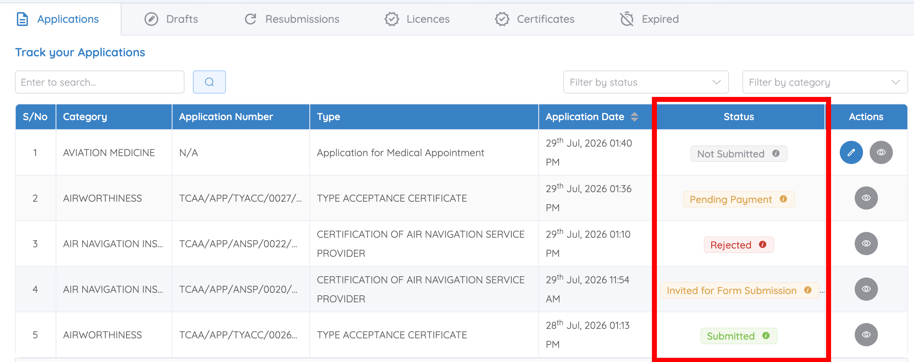

# Application status meanings

The **Track your Applications** section on the Dashboard shows real-time status for every application. You also receive an email notification whenever a status changes.

| Status | What it means |
|---|---|
| **Not Submitted** | Started and saved as a draft, but not yet submitted. |
| **Submitted** | Successfully submitted and awaiting TCAA review. |
| **Pending Payment** | Payment is required before the application can proceed. See [Pay an application fee](../billing/pay-fee.md). |
| **Invited for Meeting** | A meeting has been scheduled and requires you to confirm attendance. See [Confirm a meeting invitation](../meetings/confirm-meeting.md). |
| **Invited for Form Submission** | Additional application forms must be completed before assessment can continue. See [Respond to a formal application invitation](../formal-application/respond.md). |
| **Returned for Resubmission** | The entire application has been returned for correction and resubmission. See [Resubmitting the entire application](../resubmissions/respond.md#scenario-a-resubmitting-the-entire-application). |
| **Form Resubmission** | Specific documents or sections require correction and resubmission, based on checklist evaluation. See [Resubmitting specific documents only](../resubmissions/respond.md#scenario-b-resubmitting-specific-documents-only). |
| **Rejected** | The application did not meet the applicable regulatory requirements. |

You can narrow the list with **Filter by status** on the Dashboard — see [Track your applications](../dashboard/overview.md#track-your-applications).

## Billing status (separate from application status)

Billing information appears on the **Bills** page and the **Billing** tab within an application.

| Status | What it means |
|---|---|
| **Pending** | Billing is in progress; payment isn't available yet. |
| **Billed** | An invoice has been generated and is available for payment. |
| **Paid** | Payment has been received and billing is complete. |
