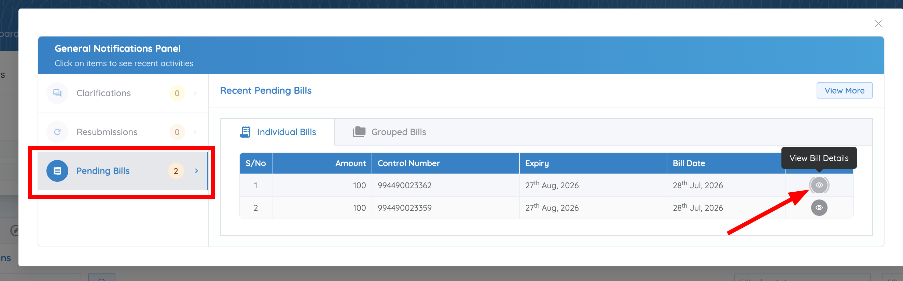
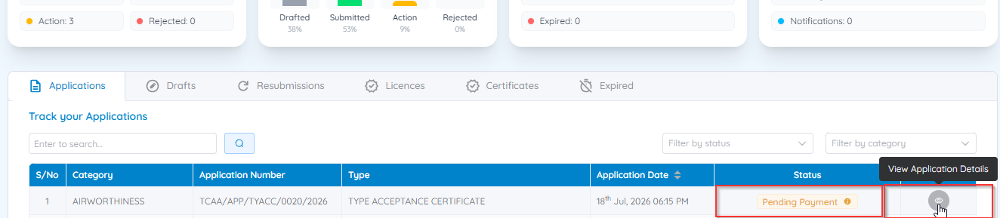
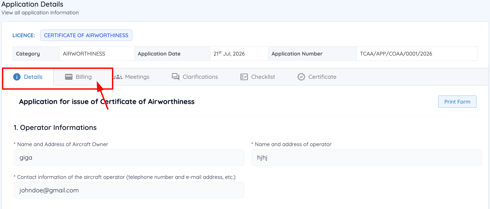
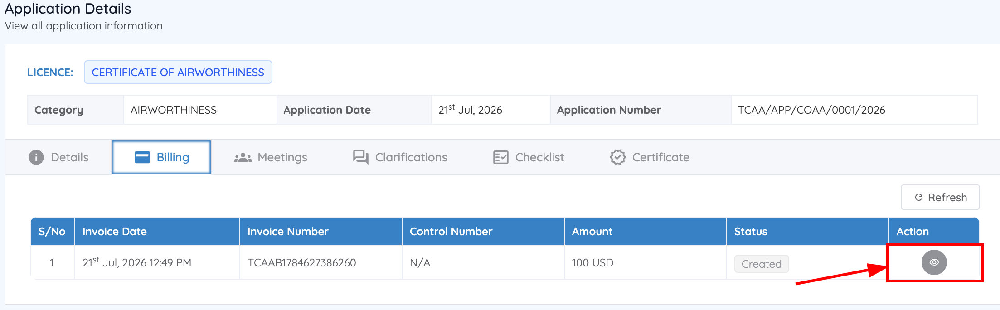
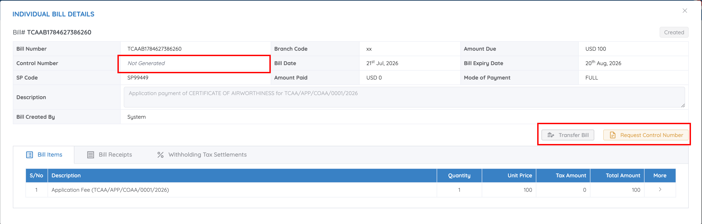
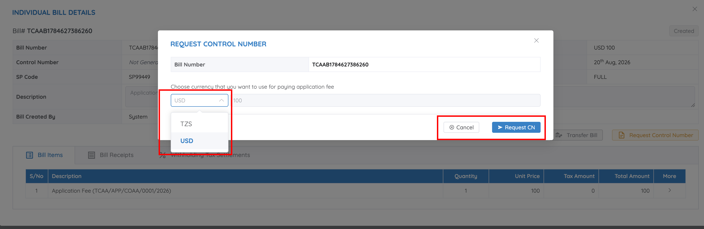
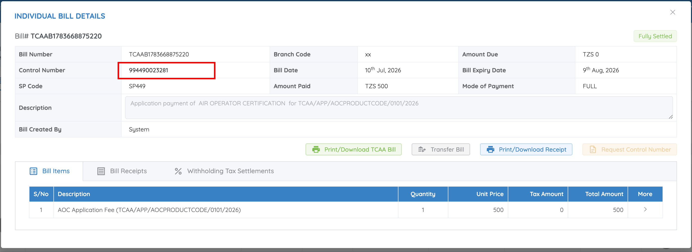
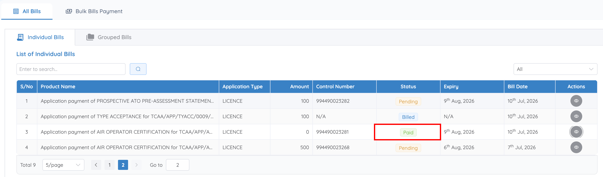
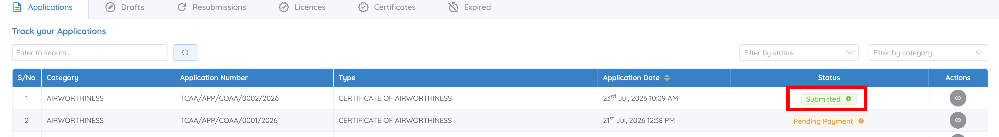

# Pay an application fee

Certain regulatory applications require payment before processing can continue. CASP generates an invoice and a Government Electronic Payment Gateway (**GePG**) Control Number for these fees.

The stage at which payment is required depends on the regulatory service and application type. For some applications, billing starts immediately after submission; for others, it's generated only after TCAA's initial review. Watch the application's status and its **Billing** tab to see when a payment is due rather than assuming it happens at a fixed point — see [Application status meanings](../applications/statuses.md).

## 1. Open the billing information

Billing appears in two places: the **Bills** page in the top navigation (every invoice across all your applications), and the **Billing** tab inside a single application. Reach the same invoice either through your notifications or by opening the application directly.

**Option 1 — Through Notifications**

1. Sign in to CASP.
2. If the **Notifications** panel doesn't open automatically, click the **Notifications** icon.
3. Select **Pending Bills**.
4. Locate the relevant application.
5. Click **View Bill Details** in the **Action** column.

    

**Option 2 — Through Track your Applications**

1. From the Dashboard, go to **Track your Applications**.
2. Select the **Applications** tab.
3. Locate the application and select the **eye (View Application Details)** action.

    

4. Open the **Billing** tab.

    

The Billing tab lists every invoice for this application, with its date, invoice number, control number, amount, and status.

## 2. Request a GePG control number

1. Select the **view** action on the invoice to open **Individual Bill Details**.
2. If a Control Number is already shown, skip to step 4. Otherwise, click **Request Control Number**.

    

    The bill shows its **Bill Number**, **Control Number**, **SP Code**, **Bill Date**, **Bill Expiry Date**, **Amount Due**, **Amount Paid**, and **Mode of Payment**, with the line items listed under the **Bill Items** tab.

    !!! warning "Bills expire"
        Each bill carries a **Bill Expiry Date** — typically about a month after the bill date. Pay before it lapses; the manual doesn't document what happens to an expired control number.

3. Choose your payment currency — **TZS** or **USD** — and click **Request CN**.

    

4. Wait for the Control Number to be generated (refresh the Billing tab if it doesn't appear automatically).
5. Complete payment through any approved payment channel that supports GePG payments, using the generated Control Number.

    

## 3. Confirm payment went through

Return to the **Billing** tab (refresh if needed) — the invoice status changes from **Pending** to **Paid**, and your application automatically proceeds to the next processing stage. On **Track your Applications**, the application status changes from **Pending Payment** to **Submitted**.

## 4. Keep a copy for your records

Once a bill is settled, its **Individual Bill Details** view offers two documents:

- **Print/Download TCAA Bill** — the invoice itself
- **Print/Download Receipt** — proof of payment

Receipts are also listed under the **Bill Receipts** tab on the bill.
