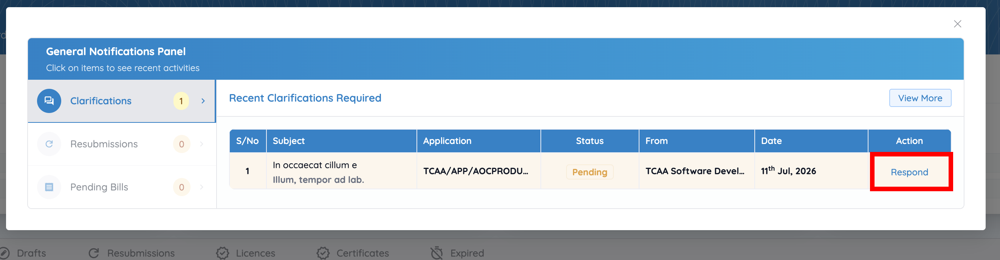
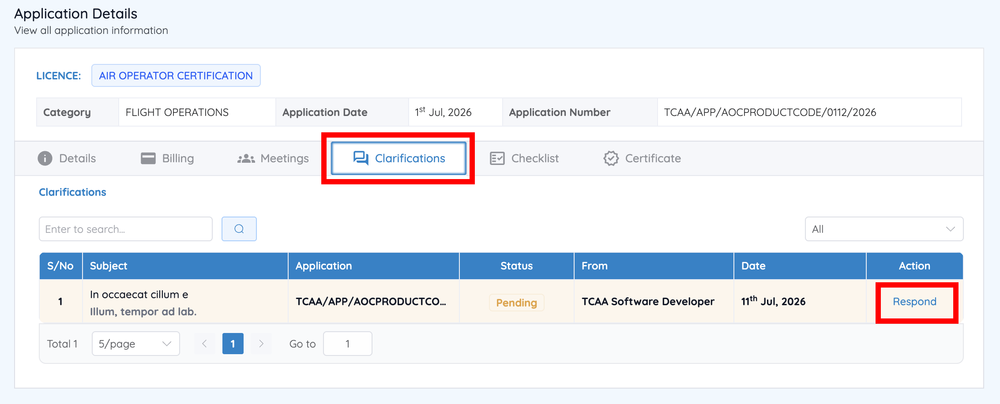
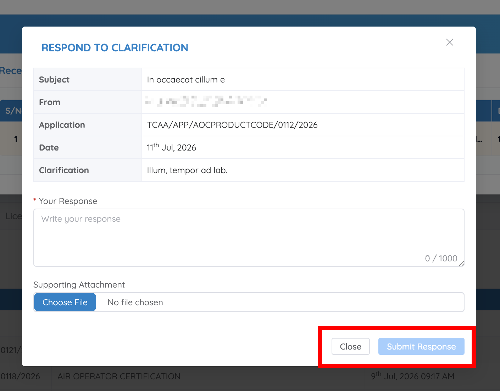

# Respond to a clarification request

During application processing, TCAA may request additional information or clarification without changing the application's status. When this happens, a notification appears in the **Notifications** panel, which opens automatically the next time you sign in.

## Access the request

**Option 1 — Through Notifications**

1. Sign in to CASP.
2. If the **Notifications** panel doesn't open automatically, click the **Notifications** icon.
3. Select **Clarifications**.
4. Locate the relevant clarification.
5. Click **Respond** in the **Action** column.

    

**Option 2 — Through Track your Applications**

1. From the Dashboard, go to **Track your Applications**.
2. Locate the relevant application — its status stays **Submitted**.
3. Click **Action** and select **View Application Details**.
4. Open the **Clarifications** tab.
5. Locate the clarification request and click **Respond**.

    

## Submit your response

1. Review the clarification details.
2. Enter your response.
3. Upload supporting documents, where required.
4. Click **Submit Response**.

    

## What happens next

Your response is forwarded to TCAA for review. A clarification doesn't change the application's status, so keep tracking it from the **Applications** tab — see [Application status meanings](../applications/statuses.md).
