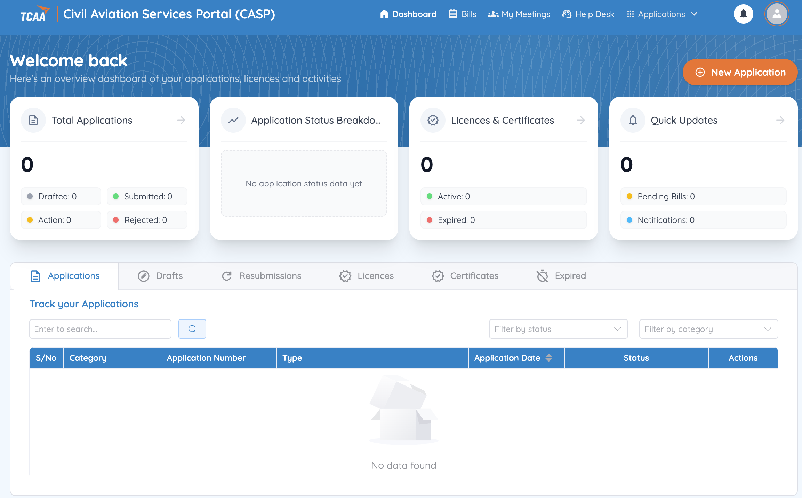
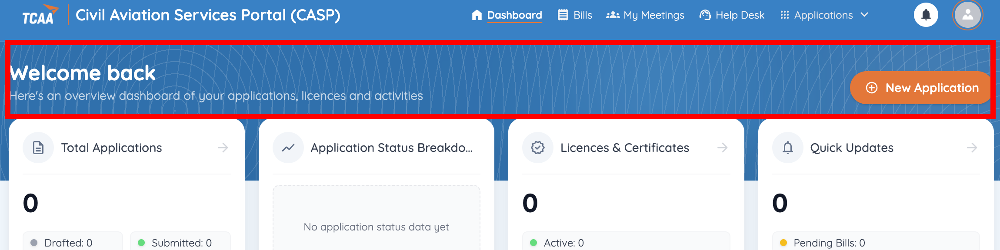
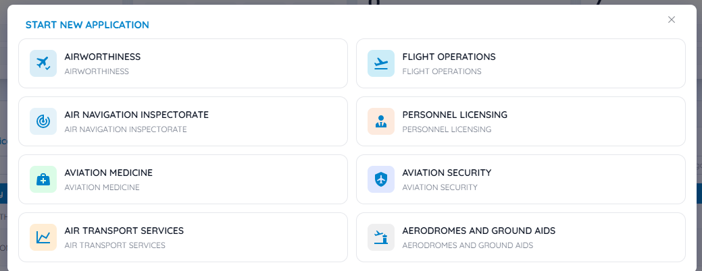
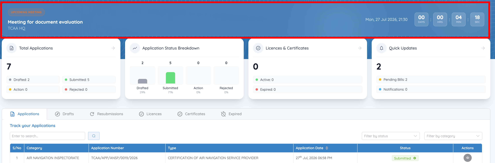
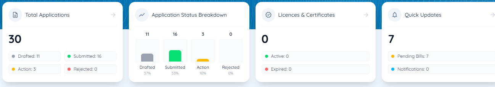
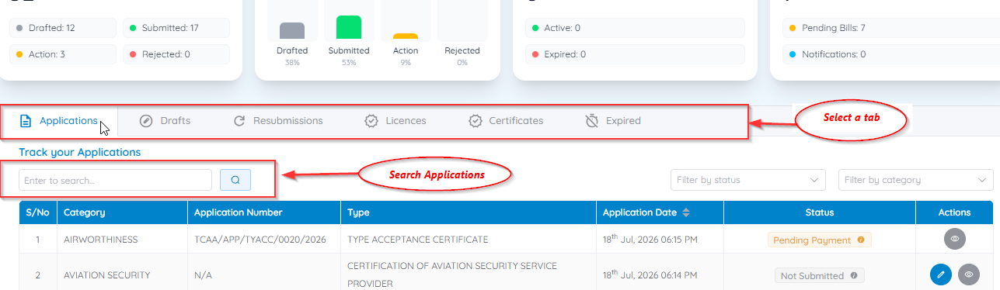
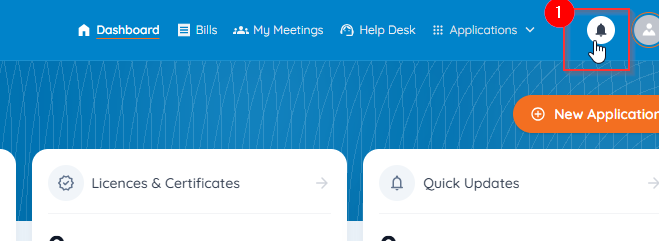
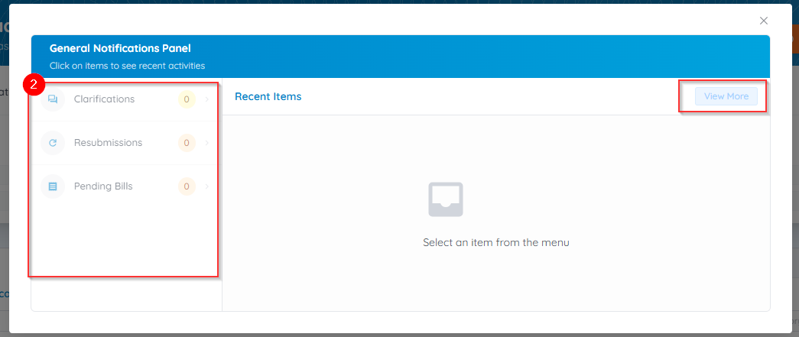

# Understanding the Dashboard

The Dashboard is your main workspace in CASP. It opens automatically after you sign in and gives you a single, centralised view of everything happening across your applications, licences, and account.

From here you can:

- Start new service applications
- Monitor the status of submitted applications
- Resume draft applications
- Respond to actions requiring your attention
- View licences and certificates
- Review notifications and pending bills
- Track application progress
- Access your account settings

## Top navigation

The blue bar across the top of every page carries the portal-wide destinations:

| Item | Takes you to |
|---|---|
| **Dashboard** | This page |
| **Bills** | All invoices across your applications — see [Pay an application fee](../billing/pay-fee.md) |
| **My Meetings** | Every meeting linked to your applications — see [View your meeting records](../meetings/view-meetings.md) |
| **Applications** | A dropdown of your application views |
| **Help Desk** | TCAA support from inside the portal |
| **Bell icon** | The [Notifications panel](#notifications) |
| **Profile icon** | [My Profile](../account/edit-profile.md), entity records, and Logout |

## Dashboard header

The header shows a welcome message and the **New Application** button, which opens the list of available regulatory service streams.

Selecting **New Application** displays the streams you can apply under:

See [Start a new application](../applications/start-application.md) for the full walkthrough.

## Upcoming meeting countdown

When you have a meeting coming up, an **UPCOMING MEETING** banner replaces the usual welcome message at the top of the Dashboard.

It shows:

- The meeting title — for example, *Meeting for document evaluation*
- The venue — for example, *TCAA HQ*
- The scheduled date and time
- A live countdown in **DAYS**, **HRS**, **MIN**, and **SEC**

The banner appears only once all three of these are true:

1. TCAA has scheduled a meeting on one of your applications.
2. You have [confirmed attendance](../meetings/confirm-meeting.md) by proposing a date and attendees.
3. TCAA has approved your proposal.

So if you're expecting a meeting and see no countdown, the most likely reason is that your proposal is still waiting on TCAA — or that you haven't submitted one yet. Check the application's status and the **Meetings** tab.

!!! tip "The countdown is a reminder, not the invitation"
    The full details — agenda, venue or virtual meeting link, and any preparation instructions — are in the invitation email and on the application's **Meetings** tab. See [View your meeting records](../meetings/view-meetings.md).

## Summary cards

Four interactive cards summarise your account at a glance — **Total Applications**, **Application Status Breakdown**, **Licences & Certificates**, and **Quick Updates**. Select a card to open the corresponding detail page — see [View and download an issued document](../applications/licences.md) for the Licences & Certificates card.

## Track your applications

At the bottom of the Dashboard (or via the **Total Applications** card), this section lists your applications and credentials in a searchable table. Switch between **Applications**, **Drafts**, **Resubmissions**, **Licences**, **Certificates**, and **Expired** using the tabs.

The table shows the application category, application number, type, application date, current status, and available actions for each record. To narrow a long list:

- Type in the **search box** to find a specific record
- Use **Filter by status** or **Filter by category**
- Sort by clicking the **Application Date** column header

See [Application status meanings](../applications/statuses.md) for what each status badge tells you to do next.

## Notifications

Click the bell icon in the top navigation to open the **Notifications panel**, which surfaces items needing your attention:

- [Clarifications](../clarifications/respond.md)
- [Resubmissions](../resubmissions/respond.md)
- Pending Bills
- [Meeting Invitations](../meetings/confirm-meeting.md)

Select a notification to view its details and complete the required action.

!!! warning "Check regularly"
    Delays in completing required actions within the specified timeframes will delay TCAA's processing of your application.
