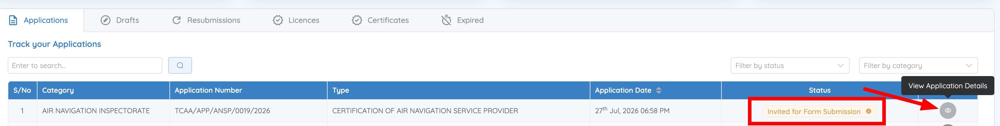
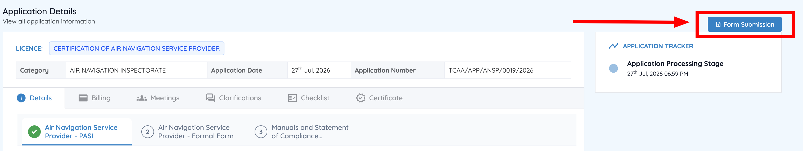

# Respond to a formal application invitation

After you submit an initial application, TCAA may ask you to complete one or more additional forms before the application can proceed — most commonly at the start of the formal application stage. When this happens, the application status changes and you'll receive an email notification.

## 1. Open the formal application

1. From the Dashboard, go to **Track your Applications**.
2. Locate the application with the status **Invited for Form Submission**.
3. Click **Action** and select **View Application Details**.

    

4. Click **Form Submission**.

    

## 2. Complete and submit

1. Complete the required sections of the formal application.
2. Submit the application for review.

## What happens next

Your formal application moves on to TCAA for review. Keep tracking its status from the **Applications** tab — see [Application status meanings](../applications/statuses.md).
