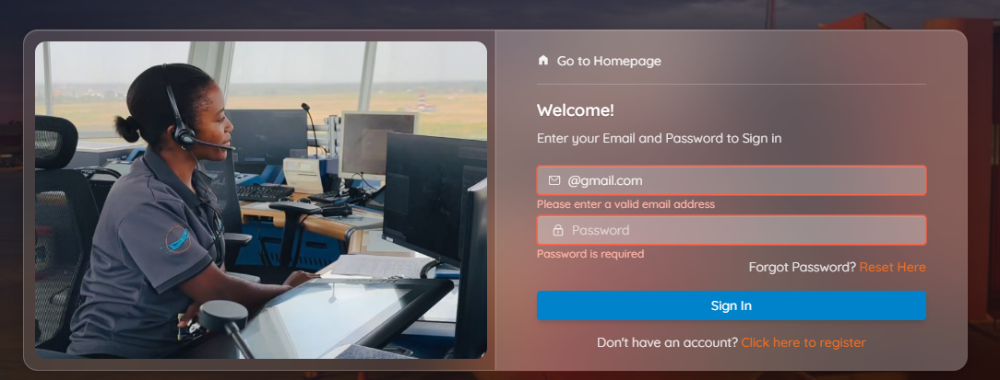
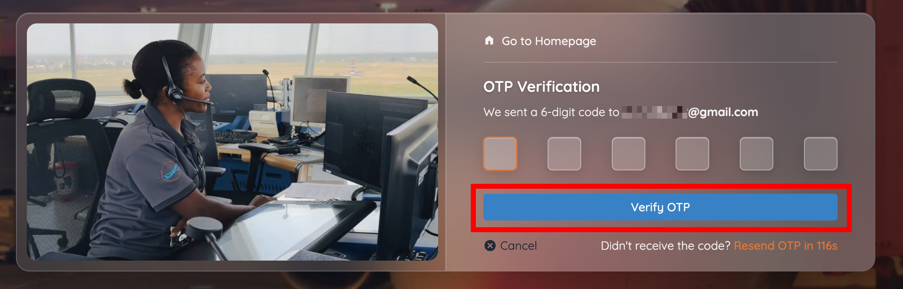
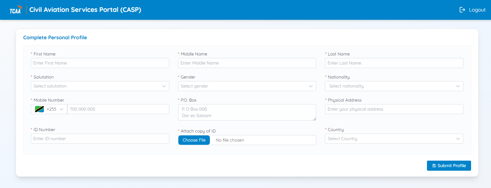
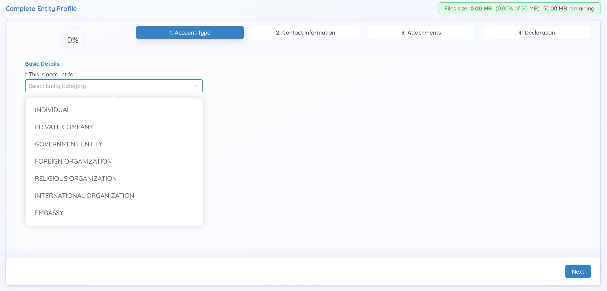
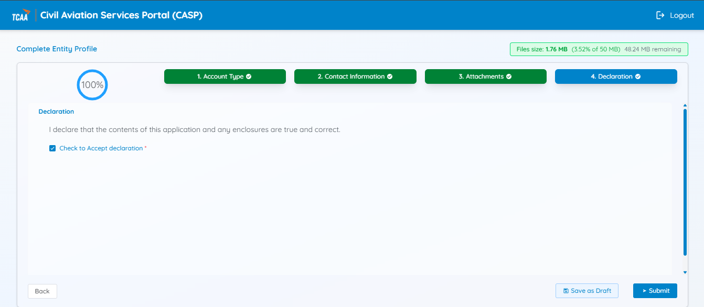

# First login and profile completion

After you activate your account, you must complete two profile sections before you can use any CASP service: your **personal profile**, and your **entity (organisation) profile**.

!!! warning "This is mandatory"
    You cannot submit any service application until profile completion reaches 100%.

## 1. Sign in

Signing in takes two steps: your password, then a one-time password (OTP) sent to your email.

1. Go to the CASP login page.
2. Enter your registered email address and password.
3. Click **Sign In**.

    

4. CASP emails a **6-digit One-Time Password (OTP)** to your registered address.
5. Open the email, retrieve the OTP, and enter it on the verification page.
6. Click **Verify OTP**.

    

!!! tip "Didn't get the code?"
    The OTP screen has a **Resend OTP** link, which becomes available after a short countdown (shown on the button). Check your spam folder before resending.

Once verified, the system grants access to your CASP profile page.

Forgot your password? Use the **Reset Here** link next to the password field — see [Reset a forgotten password](reset-password.md). The sign-in screen also carries a **Need help? View the Portal User Manual** link.

## 2. Complete your personal profile

1. Fill in the required personal details — name, salutation, gender, nationality, mobile number, P.O. Box, physical address, ID number, a copy of your ID, and country.
2. Click **Submit Profile**.

    

## 3. Complete your entity (organisation) profile

CASP also requires a profile for the organisation you represent. This form has four sections: **Account Type**, **Contact Information**, **Attachments**, and **Declaration**.

1. Select your **Account Type** — **Individual**, **Private Company**, **Government Entity**, **Foreign Organization**, **Religious Organization**, **International Organization**, or **Embassy**.

    

2. Complete the required information in the **Account Type** section, then continue to **Contact Information** and **Attachments**, completing all mandatory fields and uploading your organisation's supporting documents. The exact fields shown depend on the Account Type you selected.
3. On the **Declaration** section, check **Accept declaration**.
4. Click **Submit**.

    

The system displays: *"Profile submitted. Please sign in again to access the portal."*

5. Sign in again to access all CASP services.

!!! warning "Profile completion is mandatory"
    You cannot submit any service application until your profile is complete.

## Next step

Once your profile is 100% complete, head to the [Dashboard](../dashboard/overview.md) to start your first application.
