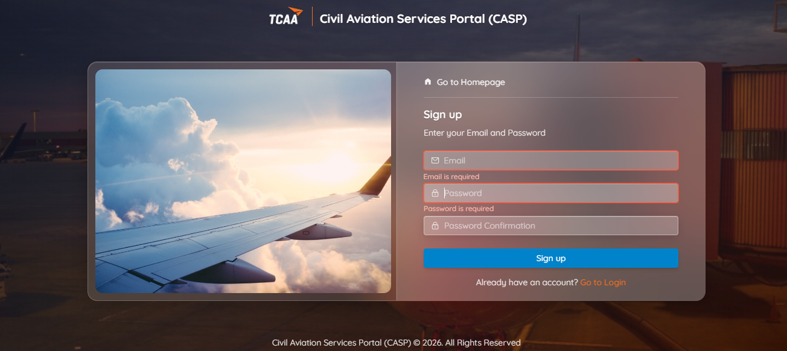

# Create your CASP account

Before you can submit any application to TCAA, you need a Civil Aviation Services Portal (CASP) account.

!!! tip "Before you start"
    Check the [account types and registration prerequisites](../index.md) first — you'll need an actively monitored email address, a valid mobile number, and your official registration or identity details. Choosing the wrong account type (Organization vs Individual) means starting over.

## Steps

1. Go to **[https://portal.tcaa.go.tz/register](https://portal.tcaa.go.tz/register)**.
2. Enter your email address and create a password.
3. Click **Sign up**.

    

4. Open the activation email TCAA sends to that address.
5. Select the activation link in the email to activate your account.

!!! success "Next step"
    Once your account is active, continue to [First login and profile completion](first-login.md).

!!! question "Didn't receive the activation email?"
    Check your spam/junk folder first. If it still hasn't arrived, call the TCAA Help Desk on the toll-free line **0800 110 193** for assistance.
