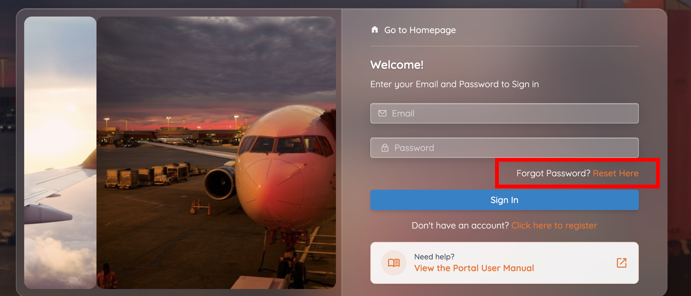
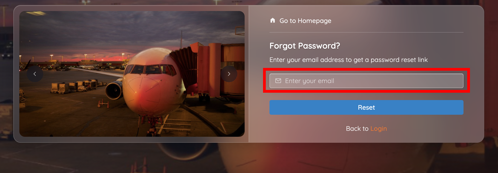
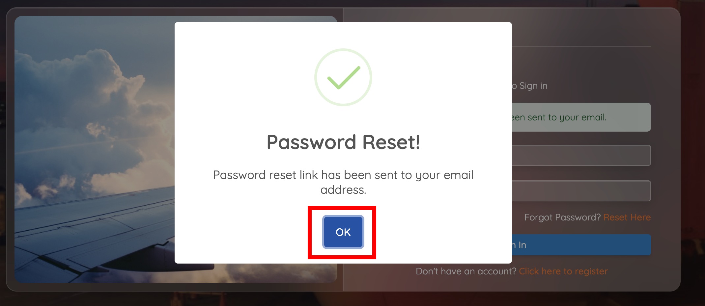
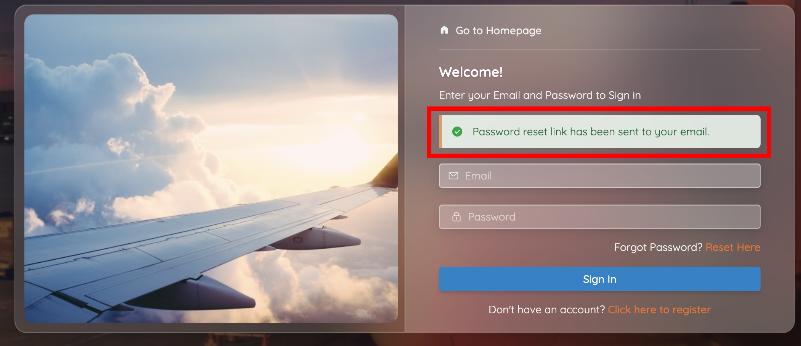

# Reset a forgotten password

If you've forgotten your password, you can reset it yourself using the email address registered to your CASP account.

!!! tip "Before you start"
    You need access to your registered email inbox — the reset link is sent there and nowhere else. If you've lost access to that mailbox, call the TCAA Help Desk on **0800 110 193** instead.

## 1. Request the reset

1. On the **Sign In** page, click **Reset Here** next to *Forgot Password?*

    

2. Enter your registered email address.
3. Click **Reset**, then click **OK** on the confirmation.

    

    

CASP sends a password reset link to your registered email address and returns you to the sign-in page with a confirmation banner.

## 2. Set the new password

1. Open the password reset email from TCAA.
2. Click the password reset link.
3. Enter a new password.
4. Re-enter the password to confirm.
5. Click **Reset Password**.

The system confirms the reset. You can now sign in with your new password.

!!! success "Next step"
    Sign in as usual — see [First login and profile completion](first-login.md). Remember that signing in still requires the [one-time password (OTP)](first-login.md#1-sign-in) sent to your email.

!!! question "Reset email hasn't arrived?"
    Check your spam/junk folder first. If it still hasn't arrived, request the reset again, or call the Help Desk on **0800 110 193**.

Already signed in and just want a new password? Use [Change your password](../account/change-password.md) instead — you don't need the email round-trip for that.
