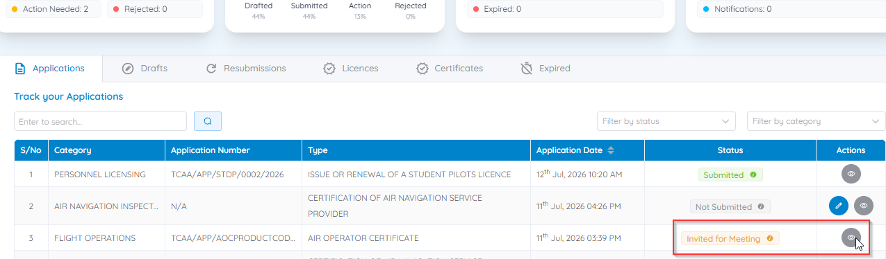
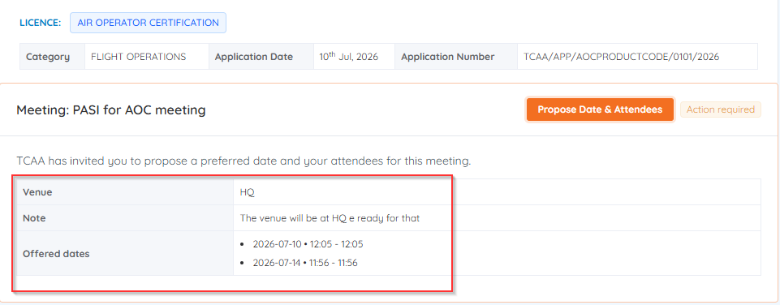
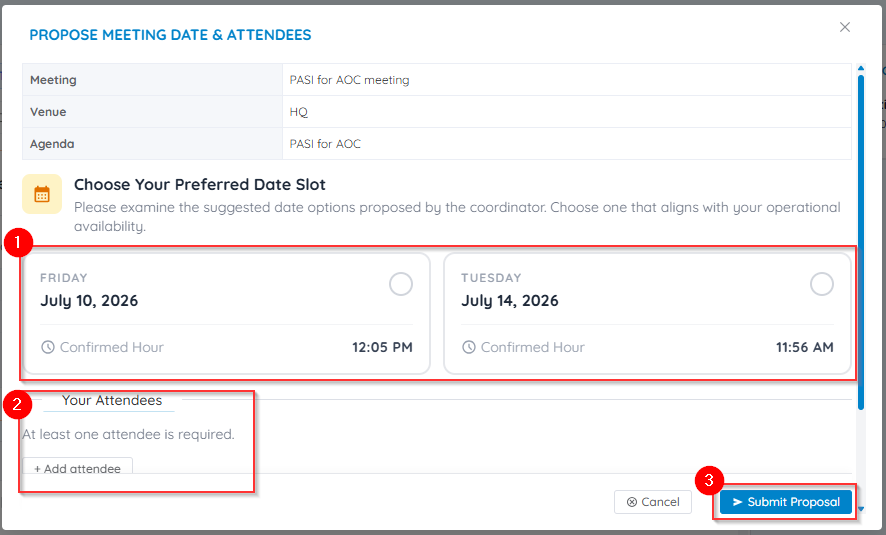

# Confirm a meeting invitation

Certain certification and approval processes require you to attend a meeting with TCAA during evaluation. When one is scheduled, you receive an email with the meeting date, time, venue (or virtual meeting details), and any preparation instructions.

## Confirm your attendance

1. Open the meeting invitation email from TCAA and review the details.
2. Log in to CASP.
3. From the Dashboard, go to **Track your Applications**.
4. Locate the application with status **Invited for Meeting**.
5. Click the **Action** button and select **View Application**.

    

6. Review the meeting details and click **Propose Date & Attendees**.

    

7. Choose a date from the proposed slots, then click **+ Add attendee** to name who from your organisation will attend, and click **Submit Proposal**.

    

!!! tip "Who you can add"
    Attendees are the people from your entity who will represent you at the meeting.

After confirmation, the meeting status updates and TCAA is notified that you'll attend.

## What happens next

Your proposal goes to TCAA for approval. Once it's approved, an **UPCOMING MEETING** banner with a live countdown to the meeting date appears at the top of your [Dashboard](../dashboard/overview.md#upcoming-meeting-countdown).

No countdown yet? Your proposed date is most likely still awaiting TCAA's approval.
