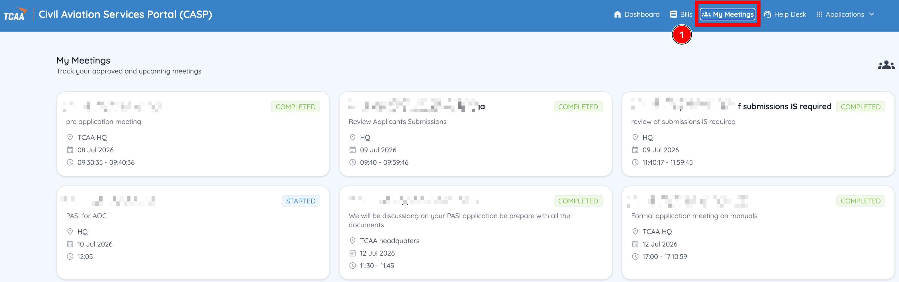
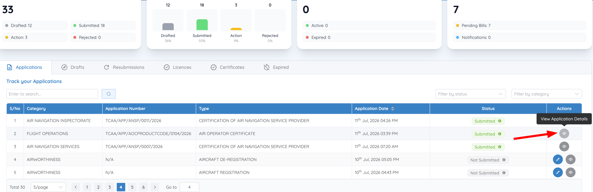
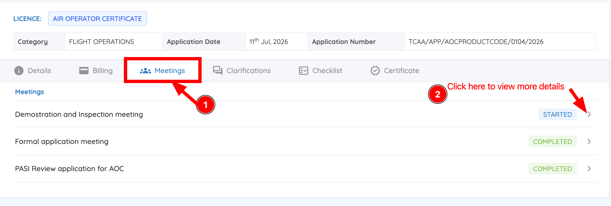

# View your meeting records

CASP keeps a record of every meeting linked to your applications.

## View meetings across all applications

1. From the Dashboard, click **My Meetings**.
2. The **My Meetings** page lists all scheduled, ongoing, and completed meetings tied to your applications.

    

## View meetings for one specific application

1. From the Dashboard, go to **Track your Applications**.
2. Locate the application and select **View Application Details**.

    

3. Open the **Meetings** tab.

    

This tab shows only the meetings associated with that application, along with their status and details.
