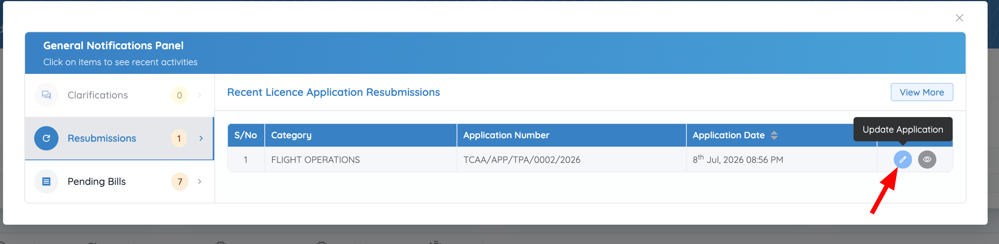
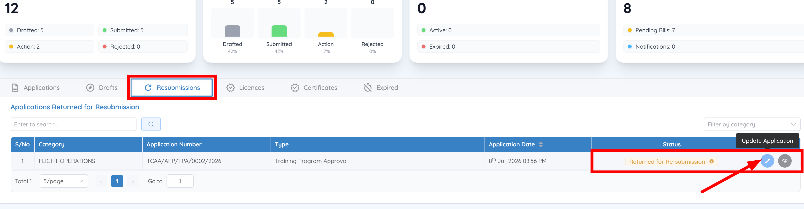
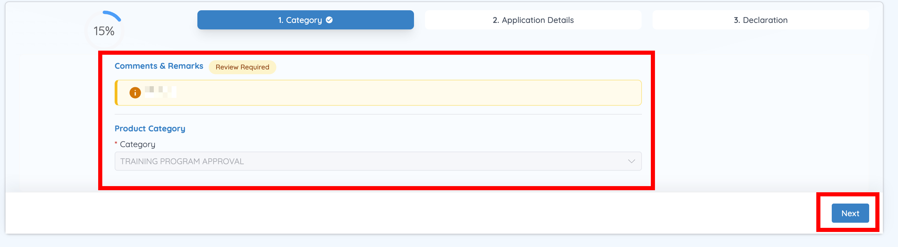
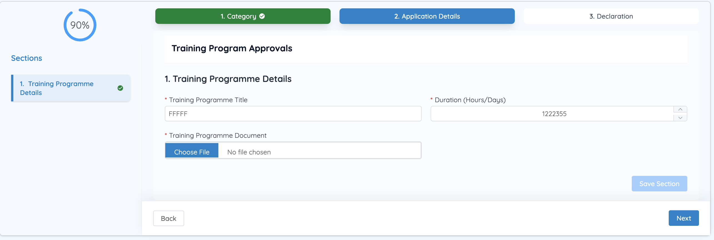
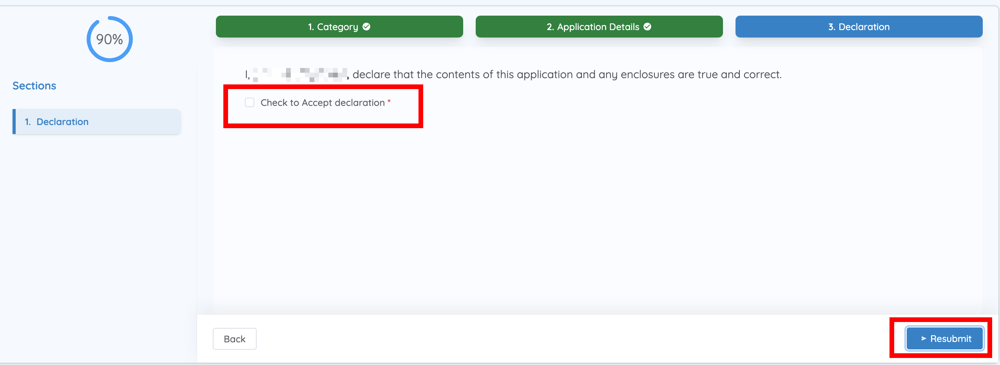
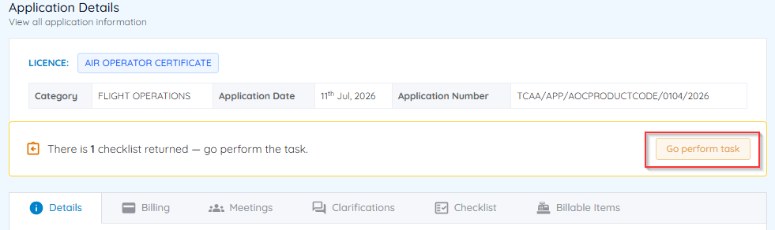
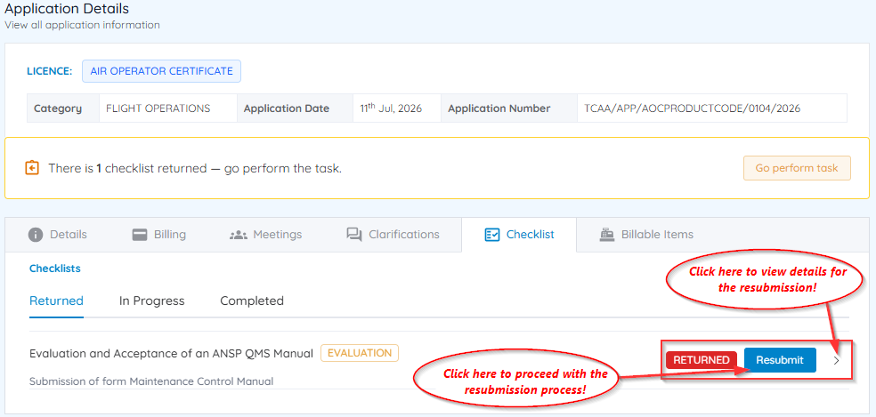
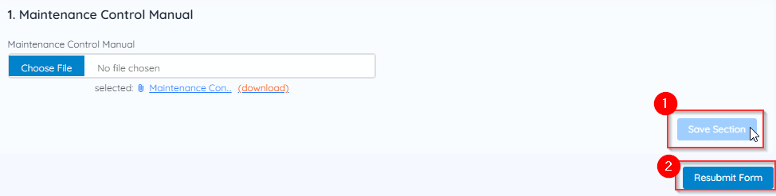

# Respond to a resubmission request

During review, TCAA may identify non-compliant documents or request more information. When this happens, the application status changes and you're notified by email to review the comments in CASP and resubmit what's required.

There are two different resubmission scenarios — resubmitting the **entire application**, or resubmitting **specific documents** only. Check which one applies to you before following the steps below.

## Access the request

After receiving the resubmission email, log in to CASP and access the request either way:

**Option 1 — Through Notifications**

1. Sign in to CASP.
2. If the **Notifications** panel doesn't open automatically, click the **Notifications** icon.
3. Select the **Resubmissions** notification.
4. Click **Update Application**.

    

**Option 2 — Through Track your Applications**

1. From the Dashboard, go to **Track your Applications**.
2. Open the **Resubmissions** tab.
3. Locate the relevant application.
4. Click **Action** and select **Update Application**.

    

## Scenario A: Resubmitting the entire application

Use this when TCAA requires the complete application to be revised.

1. Review the comments and remarks TCAA has provided.

    

2. Click **Next**.
3. Update the application as required, completing all applicable sections.

    

4. Click **Next**, then check **Accept Declaration**.
5. Click **Resubmit**.

    

## Scenario B: Resubmitting specific documents only

Use this when only particular documents or sections require correction.

1. On the Application Details page, select **Go Perform Task**.

    

2. Review the document checklist and the inspector's comments for each document requiring correction.
3. Click **Resubmit** next to the relevant checklist item.

    

4. Replace or upload the revised document.
5. Click **Save Section**. Repeat for each document identified for resubmission.
6. After updating all required documents, click **Resubmit Form**.

    

## What happens next

Your application is returned to TCAA for further document evaluation. Track its progress from the **Applications** tab on your Dashboard until review is complete — see [Application status meanings](../applications/statuses.md).

Once TCAA approves the application, its licence, permit, or certificate becomes available to view and download — see [View and download an issued document](../applications/licences.md).
